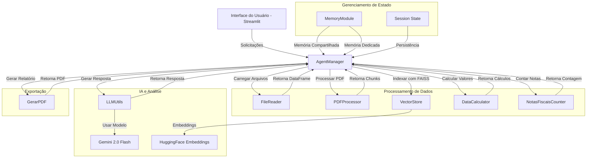

# \# Diagrama de Arquitetura do ChatFiscal

## Visão Geral

O ChatFiscal segue uma arquitetura modular composta por um Agente Pai (`AgentManager`) e módulos especializados. Abaixo está o diagrama representando as interações entre os componentes principais:

```mermaid
graph TD
    A[Interface do Usuário (Streamlit)] -->|Solicitações| B[AgentManager]
    B -->|Carregar Arquivo| C[FileReader]
    B -->|Validar Dados| D[DataValidator]
    B -->|Gerar Resposta| E[LLMUtils]
    B -->|Gerar Visualizações| F[Visualization]
    B -->|Exportar Relatórios| G[Exporter]


    subgraph Módulos
        C
        D
        E
        F
        G
    end


    C -->|Retorna DataFrame| B
    D -->|Retorna Relatório| B
    E -->|Retorna Resposta| B
    F -->|Retorna Gráficos| B
    G -->|Retorna Arquivos| B
```


## Descrição dos Componentes

### **AgentManager**

- **Função**: Coordenar os módulos filhos e consolidar as respostas.
- **Interações**:
  - Recebe solicitações da interface do usuário.
  - Delegar tarefas aos módulos especializados.
  - Consolidar os resultados e retornar à interface.


### **Módulos Filhos**

1. **FileReader**:
   - Processa arquivos CSV e XML.
   - Retorna um DataFrame padronizado.
2. **DataValidator**:
   - Valida dados fiscais (CFOP, valores negativos).
   - Retorna um relatório de inconsistências.
3. **LLMUtils**:
   - Gera respostas em linguagem natural com base nos dados carregados.
4. **Visualization**:
   - Gera gráficos interativos e dashboards.
5. **Exporter**:
   - Exporta relatórios e dados em formatos como CSV, JSON e Word.

---

Este diagrama e descrição ajudam a entender como os componentes do ChatFiscal interagem para fornecer uma experiência integrada ao usuário.

atuatliza esse aquivo md com as alterações que nao tem no app

Agora vou analisar os arquivos do projeto para identificar os componentes que não estão documentados no arquivo MD e criar uma versão atualizada do diagrama de arquitetura.

Baseado na análise dos arquivos do projeto ChatFiscal, identifiquei diversos componentes e funcionalidades que não estão documentados no arquivo MD original. Aqui está a versão atualizada:[^1][^2][^3][^4][^5][^6]

# Diagrama de Arquitetura do ChatFiscal

## Visão Geral

O ChatFiscal segue uma arquitetura modular composta por um Agente Pai (`AgentManager`) e módulos especializados. Abaixo está o diagrama representando as interações entre os componentes principais:




## Descrição dos Componentes

### **AgentManager**

- **Função**: Coordenar os módulos filhos e consolidar as respostas
- **Interações**:
    - Recebe solicitações da interface do usuário
    - Delega tarefas aos módulos especializados
    - Gerencia vetorstore FAISS para PDFs indexados
    - Mantém controle de arquivos processados
    - Implementa sistema de priorização para cálculo de valores
    - Consolida resultados e retorna à interface


### **Módulos Filhos**

1. **FileReader**:
    - Processa arquivos CSV, XML (NF-e, NFS-e, CT-e, MDF-e) e PDF
    - Suporta múltiplos formatos de XML com parsers específicos
    - Extração hierárquica de dados (Emitente, Destinatário, Prestador, Tomador)
    - Retorna DataFrame padronizado e organizado por categorias
2. **PDFProcessor** (integrado no AgentManager):
    - Processa PDFs usando PyPDFLoader e PyPDF2 (fallback)
    - Divide documentos em chunks com RecursiveCharacterTextSplitter
    - Indexa chunks no FAISS para busca vetorial
    - Armazena metadados (nome, chunks, timestamp, status)
3. **VectorStore** (FAISS):
    - Armazena embeddings de documentos PDF
    - Utiliza HuggingFace Embeddings (all-MiniLM-L6-v2)
    - Permite busca semântica em múltiplos PDFs
    - Persistência em diretório local
4. **LLMUtils**:
    - Gera respostas em linguagem natural usando Gemini 2.0 Flash
    - Três modos de resposta: CSV, PDF e Consolidada
    - Formatação inteligente de campos técnicos
    - Detecção de saudações vs perguntas reais
    - Suporte a histórico de conversação
    - Prompts especializados para análise fiscal
5. **DataCalculator** (método `calcular_soma_valores`):
    - Calcula soma total de valores sem duplicação
    - Sistema de priorização de colunas de valor
    - Ignora colunas de impostos/taxas/controle
    - Retorna detalhamento por coluna (soma, média, min, max)
    - Consolida dados de CSV e XML
6. **NotasFiscaisCounter** (método `contar_notas_fiscais`):
    - Conta total de notas fiscais
    - Distingue entre NF-e e NFS-e
    - Detecta documentos mistos
    - Retorna tipo de documento predominante
7. **GerarPDF**:
    - Exporta relatórios de auditoria fiscal em PDF
    - Utiliza ReportLab para geração
    - Inclui métricas principais, análise de qualidade
    - Detecta tipo de documento e completude dos dados
    - Lista arquivos processados com status
8. **MemoryModule**:
    - **MemoriaCompartilhada**: Dados compartilhados entre módulos com thread-safety
    - **MemoriaDedicada**: Dados isolados por módulo
    - Gerenciamento com locks para concorrência
9. **SessionState** (Streamlit):
    - `dados_tabulares`: Lista de DataFrames carregados
    - `df_csv_unificado`: DataFrame consolidado
    - `pdf_list`: Lista de índices FAISS
    - `pdf_metadata`: Metadados dos PDFs
    - `texto_pdf_list`: Texto extraído dos PDFs
    - `past` / `generated`: Histórico de conversação
    - `arquivos_carregados`: Controle de arquivos processados

### **Funcionalidades Adicionais**

- **Detecção Automática de Formato**: Identifica automaticamente o tipo de XML (NF-e, NFS-e, CT-e, etc.)
- **Processamento Multi-Formato**: Suporta CSV, XML de múltiplos tipos e PDF em uma única sessão
- **Análise Consolidada**: Cruza informações entre dados estruturados e documentos PDF
- **Sistema de Logging**: Registra todas as operações em arquivo e console
- **Deduplicação Inteligente**: Evita duplicação de dados ao carregar múltiplos arquivos
- **Contexto Enriquecido**: Fornece à LLM tanto dados estruturados (JSON) quanto contexto textual (PDF)
- **Interface Customizada**: Avatares personalizados, dicas inteligentes do Corujito, estilização completa

***

## Fluxo de Dados Típico

1. **Upload de Arquivo**: Usuário faz upload via Streamlit
2. **Detecção de Tipo**: AgentManager identifica formato (CSV/XML/PDF)
3. **Processamento**:
    - **CSV/XML**: FileReader → DataFrame → Session State
    - **PDF**: PyPDFLoader → Chunks → FAISS Index → Session State
4. **Pergunta do Usuário**: Enviada para AgentManager
5. **Análise de Contexto**: Verifica dados disponíveis (CSV, PDF ou ambos)
6. **Geração de Resposta**:
    - LLMUtils recebe contexto apropriado
    - Gemini 2.0 Flash processa com prompt especializado
    - Resposta formatada retornada ao usuário
7. **Exportação** (opcional): Geração de relatório PDF com todos os dados da sessão

***

Este diagrama e descrição refletem a arquitetura completa e atualizada do ChatFiscal, incluindo todos os componentes implementados nos arquivos do projeto.

<div align="center">⁂</div>

[^1]: agent_manager.py

[^2]: gerar_pdf.py

[^3]: app.py

[^4]: memory_module.py

[^5]: llm_utils.py

[^6]: file_reader.py

